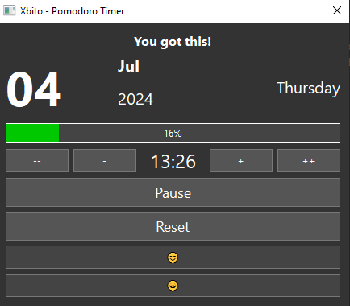

# Xbito - Pomodoro Timer

This project is a Pomodoro timer application designed to enhance your productivity while keeping you motivated with uplifting phrases. Developed with Python and PySide6, Xbito offers a customizable timer, session tracking, and audio notifications.



## Origin Story

I began this as a feature within a private to-do app connected to Google Tasks, born out of a desire to:

- **Reignite a Coding Passion**: Transitioning from occasional coding contributions back to daily coding practice.
- **Explore Desktop Application Development**: Venturing beyond web apps and APIs into the realm of desktop applications for Windows.
- **Leverage LLMs for Code Assistance**: Utilizing various LLMs, including Llama 3, Google Gemini, OpenAI GPT4o and o1, and GitHub Copilot, to enhance development.

Prompted by an LLM, the addition of a Pomodoro timer to the project was inspired by personal productivity practices and the engaging community of "work with me" Twitch streams, notably StudyTme.

## Key Features

- **Customizable Timer:** Set your work and break intervals to suit your productivity flow.
- **Motivational Phrases:** Receive motivational phrases at the start of each session to keep you inspired.
- **Session Tracking:** Keep track of your work sessions, including start and end times, and how you felt during each session.
- **Audio Notifications:** Get notified with a pleasant melody when it's time to start a break or resume working.
- **Yearly Activity Visualization:** View your productivity over the last year with a GitHub-style contributions graph.

## Distribute

To convert the Python app to an executable (.exe) for distribution I have used PyInstaller.

1. Install PyInstaller:
   ```
   pip install pyinstaller
   ```
2. Create the executable:
   ```
   pyinstaller --onefile --windowed --name xbitopomo app.py
   ```
3. The exe file will be in a dist folder in your project.
4. Test the exe file.

## Contributing
Contributions are welcome! Please feel free to submit a pull request or open an issue for any bugs or feature requests.

## License
This project is licensed under the MIT License - see the LICENSE file for details.

## Acknowledgments

A heartfelt thank you to:

- The Python community, for a language that's been a part of my journey since 2004.
- The PySide6 team, for their exceptional GUI toolkit.
- Cassidy Williams for the todometer app, a source of inspiration. (https://github.com/cassidoo/todometer/)
- The teams behind VS Code, Llama, Ollama, Google Gemini, OpenAI GPT4o and o1, and GitHub Copilot, for their contributions to AI and development tools.
- StudyTme, for the invaluable "Focus with me" streams that have provided companionship and focus since 2020. (https://www.twitch.tv/studytme)
- Rosannatxt, also for her Co-working streams (https://www.twitch.tv/rosannatxt)